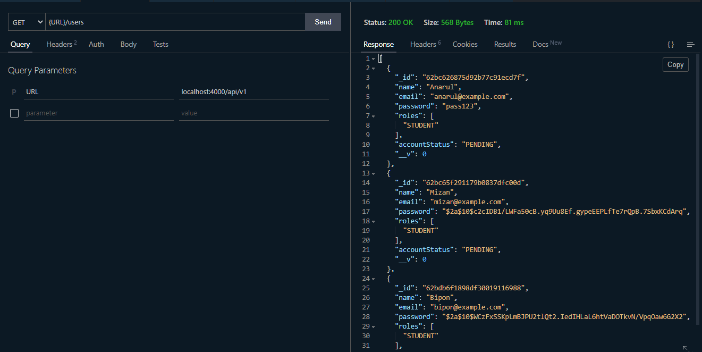
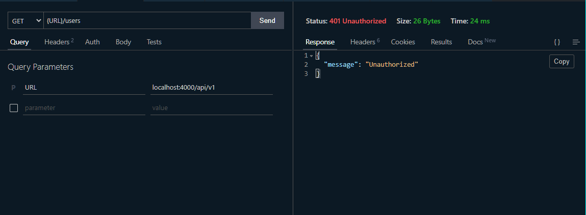
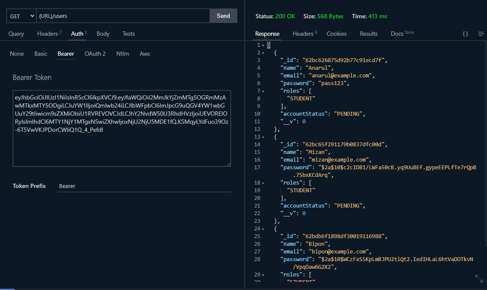
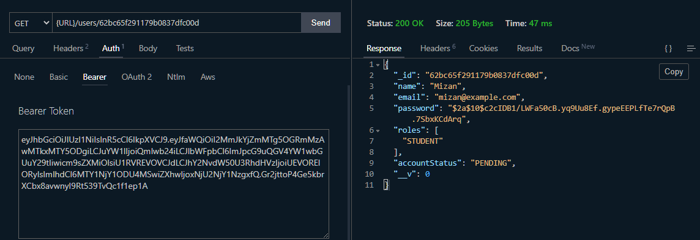
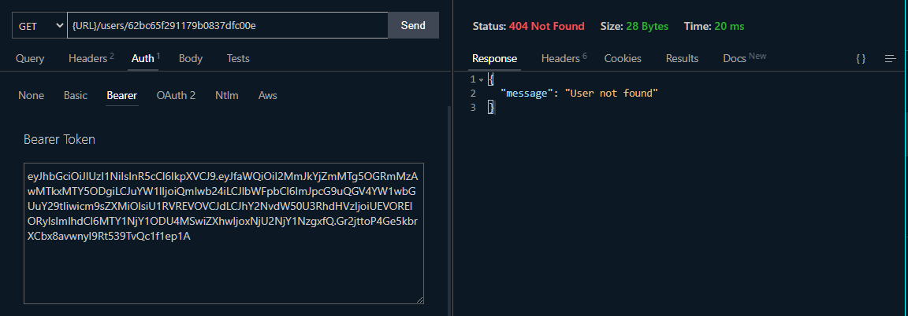
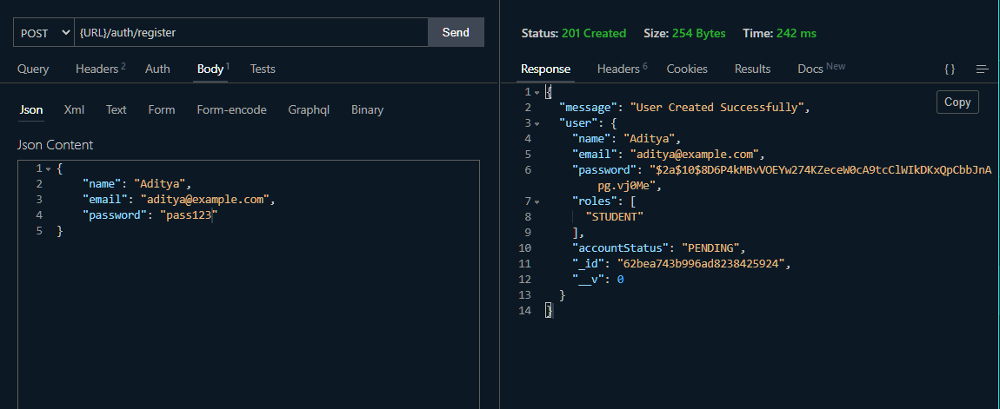
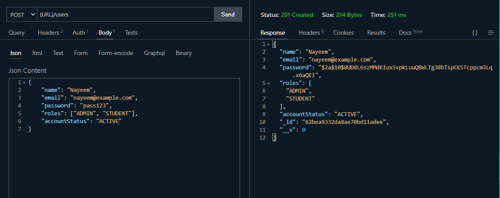
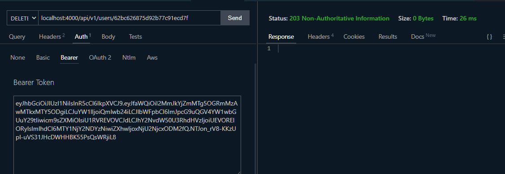
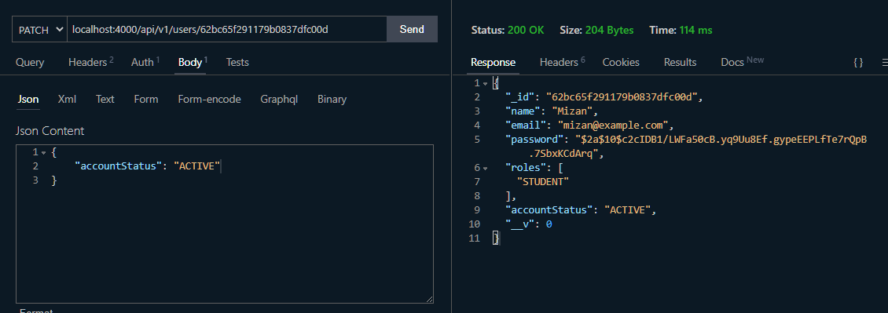

# Lecture 24 - Implement User CRUD Operations

আমরা গত ক্লাসে রেজিস্ট্রেশন, লগইন নিয়ে কাজ করেছিলাম, প্রজেক্ট রিফ্র্যাক্টর করেছিলাম, অথেনটিকেশন মিডলওয়্যার বানিয়েছিলাম। আজ আমরা user CRUD নিয়ে কাজ করবো। আমাদের নোশনে user crud এ কি কি আছে একটু দেখা যাক।


দেখা যাচ্ছে ৫টা endpoint আছে এখানে। এগুলো আমাদের তৈরি করতে হবে।

- Get Users /users
- Get User by ID /users/userId
- Create User /users
- Update User /users/userId
- Delete User /users/userId

এটা আমরা নতুন একটা সার্ভিস নিয়ে কাজ করছি যেটার নাম User. প্রথমে আমরা রাউটস তৈরি করবো। আমরা routes ফোল্ডারে গিয়ে users.js নামে একটা ফাইল ক্রিয়েট করবো। করে আমরা আমাদের রাউটারকে এক্সপ্রেস থেকে বের করে আনবো এবং তা এক্সপোর্ট করে দিবো।

```js
const router = require('express').Router();

module.exports = router;
```

এখন আমাদের রাউটস লাগবে টোটাল ৫টা। আমরা একে একে সেগুলো তৈরি করবো। প্রথমে আমরা Get Users এর জন্য রাউট তৈরি করবো। আমরা filter, sorting, pagination, select properties এর মাধ্যমে ইউজার বের করে আনতে পারি। আপাতত এগুলো আমাদের টুডু লিস্টে থাকবে। আমাদের রাউট হবে `api/v1/users?sort["by","name"]`, মেথড হবে GET, আর এটা হবে private রাউট। আমরা users.js এ এখন লিখবো।

```js
const router = require('express').Router();

/**
 * Get all users, include
 * - filter
 * - sort
 * - pagination
 * - select properties
 * @method Get
 * @route api/v1/users?sort["by","name"]
 * @visibility private
 */

router.get();

module.exports = router;
```

প্রিফিক্সিং এর জন্য আমরা index.js এ user রাউটকে ইমপোর্ট করে নিচের কোডটি লিখে দিব।

```js
// routes/index.js

const router = require('express').Router();
const authRoutes = require('./auth');
const usersRoutes = require('./users');

router.use('/api/v1/auth', authRoutes);
router.use('/api/v1/users', usersRoutes);

module.exports = router;
```

এবার আমরা ইউজার রাউটে একে একে বাকি রাউটগুলো লিখবো।

```js
// router/users.js

const router = require('express').Router();

/**
 * Get user by id or email
 */

router.get('/:userId', () => {});

/**
 * update user by id
 * @method PUT
 */

router.put('/:userId', () => {});

/**
 * update user by id
 * @method PATCH
 */

router.patch('/:userId', () => {});

/**
 * Delete user by id
 */

router.delete('/:userId', () => {});

/**
 * Get all users, include
 * - filter
 * - sort
 * - pagination
 * - select properties
 * @method Get
 * @route api/v1/users?sort["by","name"]
 * @visibility private
 */

router.get('/', () => {});

/**
 * Create new user
 */

router.post('/', () => {});

module.exports = router;
```

এখানে একটা জিনিস মনে রাখতে হবে লেখার সময় যেটা কমন রাউট মানে যে রাউট সবকিছুর সাথে থাকবে সেটাকে সবসময় নিচে লিখতে হবে। ধরেন আপনি '/users/:userid' এই রাউটে হিট করতে চাচ্ছেন। এখন যদি এটা উপরে না থেকে নিচে থাকে আর '/users' রাউট উপরে থাকে অনেক সময় উপরে এই রাউটটা পেয়ে এর রেসপন্স ব্যাক করে দিতে পারে। তাই '/users' কে সবসময় নিচে লিখতে হয়। put and patch দুইটাই আপডেটের মেথড। put ব্যবহার করে আমরা পুরো এক্সিসটিং ডাটাকে আপডেট করতে পারি। আর patch ব্যবহার করে আংশিক পরিবর্তন করতে পারি। এবার আমাদের দরকার কন্ট্রোলার এবং সার্ভিস। আমরা চলে যাই প্রথমে কন্ট্রোলারের কাছে। সেখানে আমরা users.js নামে একটা ফাইল ক্রিয়েট করবো।

```js
// controller/users.js

const User = require('../models/User');

const getUsers = (req, res, next) => {};

const getUserById = (req, res, next) => {};

const postUser = (req, res, next) => {};

const putUserById = (req, res, next) => {};

const patchUserById = (req, res, next) => {};

const deleteUserById = (req, res, next) => {};

module.exports = {
	getUsers,
	getUserById,
	postUser,
	putUserById,
	patchUserById,
	deleteUserById,
};
```

এবার একে একে ফাংশনালিটিজগুলো যোগ করবো। ফাংশনালিটিজ যোগ করতে হলে আমাদের ডাটাবেজের সাথে রিলেটেড কিছু কাজকর্ম আছে। সেগুলো কন্ট্রোলার করবে না। আগের ক্লাসে সেটা আলোচনা হয়েছিল। তার জন্য আমাদের একটা সার্ভিস লাগবে। অলরেডি আমাদের ইউজার সার্ভিস নামে একটা সার্ভিস আছে। সেখানে আমরা এই কাজগুলো করতে পারি। প্রথমে ইউজার ফাইন্ড করার একটা ফাংশন লিখে ফেলি। মনে রাখতে হবে প্রতিটা ফাংশন লিখে তা এক্সপোর্ট করতে হবে।

```js
// service/user.js

const User = require('../models/User');

const findUsers = () => {
	return User.find();
};

module.exports = {
	findUsers,
};
```

এবার আমরা আমাদের getUsers ফাংশনটি কমপ্লিট করবো।

```js
const userService = require('../service/user');

const getUsers = async (req, res, next) => {
	/**
	 * TODO: filter, sort, pagination, select
	 */

	try {
		const users = await userService.findUsers();
		return res.status(200).json(users);
	} catch (e) {
		next(e);
	}
};
```

এবার এই কন্ট্রোলারকে আমরা আমাদের রাউটের মধ্যে নিয়ে এসে ব্যবহার করবো।

```js
// routes/users.js
const usersController = require('../controller/users');

/**
 * Get all users, include
 * - filter
 * - sort
 * - pagination
 * - select properties
 * @method Get
 * @route api/v1/users?sort["by","name"]
 * @visibility private
 */

router.get('/', usersController.getUsers);

module.exports = router;
```

এবার আমরা দেখবো আমাদের এই ফাংশন কাজ করে কিনা।



আমরা দেখছি আমাদের সব ইউজার আমরা পেয়ে গেছি।

কিন্তু আমরা যদি আমাদের রিকোয়ারমেন্ট অ্যানালাইসিসে গিয়ে রাউটগুলো দেখি তাহলে দেখবো সমস্ত ইউজার রিলেটেড রিকোয়েস্ট গুলো হবে প্রাইভেট। তাহলে আমরা আমাদের অথেনটিকেট মিডলওয়্যারকে প্রত্যেকটা রাউটের মধ্যে গিয়ে লিখে দিয়ে আসতে পারি। কিন্তু যেহেতু সব ইউজার রাউটই প্রাইভেট হবে, সুতরাং এত জায়গায় না লিখে আমরা আমাদের ইনডেক্স রাউটে গিয়ে ইউজারের প্রিফিক্সিং রাউট যেটা সেখানে লিখে দিলেই সব ইউজার রাউট প্রাইভেট হয়ে যাবে।

```js
const router = require('express').Router();
const authenticate = require('../middleware/authenticate');
const authRoutes = require('./auth');
const usersRoutes = require('./users');

router.use('/api/v1/auth', authRoutes);
router.use('/api/v1/users', authenticate, usersRoutes);

module.exports = router;
```

এখন যদি আমরা রিকোয়েস্ট পাঠাই আমাদেরকে ম্যাসেজ দিবে Unauthorized।



এখন যদি আমাদের ইউজার ইনফরমেশন দেখতে হয় তাহলে দরকার হবে টোকেন। আর টোকেন পেতে আমাদের লগইন করতে হবে। চলুন লগইন করে দেখি।


আমরা টোকেন পেয়ে গেলাম। এবার টোকেন দিয়ে আমরা দেখি আমাদের ইউজার ইনফরমেশনগুলো পাই কিনা।



এবার আমরা getUserById কন্ট্রোলার তৈরি করবো। এটার জন্য আমাদের দরকার একটা আইডি। এখন সেটা আসবে params থেকে। আমরা /users এর পর যা লিখবো সেগুলোই হচ্ছে params. আমাদের কন্ট্রোলারের জন্য আমরা আগেই সার্ভিস তৈরি করে রেখেছিলাম ইউজার সার্ভিসের মধ্যে। সেটা হলো findUserByProperty। এটা এখন আমরা আমাদের কন্ট্রোলারে ইউজ করবো।

```js
// controller/users.js

const getUserById = async (req, res, next) => {
	const userId = req.params.userId;

	try {
		const user = await userService.findUserByProperty('_id', userId);

		if (!user) {
			throw error('User not found', 404);
		}
		// TODO: we have to delete the password from user object
		return res.status(200).json(user);
	} catch (e) {
		next(e);
	}
};
```

এবার আমরা আমাদের রাউটারে এই কন্ট্রোলার ফাংশন পাস করে দিবো।

```js
// routes/users.js

/**
 * Get user by id or email
 */

router.get('/:userid', usersController.getUserById);
```

এবার চেক করার পালা। আমরা একটা আইডি নিয়ে আসি ডাটাবেজ থেকে। সেটা দিয়ে চেক করবো। যদি আইডি সঠিক থাকে তাহলে সে ঠিক আউটপুট দিবে।



আর ভিন্ন কোনো আইডি হলে সে এরর দিবে।



এবার আমরা postUser কন্ট্রোলার নিয়ে কাজ করবো। এটার জন্যও আমাদের সার্ভিস তৈরি করা আছে ইউজার সার্ভিসে। সেটা হলো createNewUser। এবার এটা ব্যবহার করে আমরা আমাদের কন্ট্রোলার তৈরি করে ফেলি। কিন্তু তার আগে আমাদের createNewUser ফাংশনে একটু চেইঞ্জ করতে হবে। আমরা যদি দেখি এই ফাংশনে এখন শুধু name, email and password দিয়ে অ্যাকাউন্ট তৈরি করতে পারছি। কিন্তু আমরা যদি roles বা accountStatus দিতে চাই তাহলে কিন্তু পারবো না। তাই আমরা এখন এখানে এই অপশনটা ক্রিয়েট করবো। ইউজার মডেলে আমরা দেখতে পাচ্ছি যে ডিফল্ট হিসেবে roles এ থাকে 'STUDENT' এবং accounStatus এ থাকবে 'PENDING'।

```js
// service/user.js

const createNewUser = ({ name, email, password, roles, accountStatus }) => {
	const user = new User({
		name,
		email,
		password,
		roles: roles ? roles : 'STUDENT',
		accountStatus: accountStatus ? accountStatus : 'PENDING',
	});
	return user.save();
};
```

```js
// controller/users.js

const postUser = async (req, res, next) => {
	const { name, email, password, roles, accountStatus } = req.body;

	try {
		const user = await userService.createNewUser({
			name,
			email,
			password,
			roles,
			accountStatus,
		});
		return res.status(201).json(user);
	} catch (e) {
		next(e);
	}
};
```

এখন এখানে পাসওয়ার্ড হ্যাশ করা হয়নি। হ্যাশ করার কাজটা করতে হবে আমাদের সার্ভিসে। কিন্তু আমাদের auth সার্ভিসের মধ্যে যে রেজিস্টার সার্ভিস আছে সেটাতে পাসওয়ার্ড হ্যাশ করা আছে। সুতরাং আমরা এখানে সেটা ইউজ করবো। তার আগে একটু কাজ করে নিতে হবে।

```js
// service/auth.js

const registerService = async ({
	name,
	email,
	password,
	roles,
	accountStatus,
}) => {
	let user = await findUserByProperty('email', email);
	if (user) {
		throw error('User already exists', 400);
	}

	const salt = await bcrypt.genSalt(10);
	const hash = await bcrypt.hash(password, salt);
	return createNewUser({ name, email, password: hash, roles, accountStatus });
};
```

```js
// controller/users.js

const authService = require('../service/auth');

const postUser = async (req, res, next) => {
	const { name, email, password, roles, accountStatus } = req.body;

	try {
		const user = await authService.registerService({
			name,
			email,
			password,
			roles,
			accountStatus,
		});
		return res.status(201).json(user);
	} catch (e) {
		next(e);
	}
};
```

যেহেতু রেজিস্টার সার্ভিসে কিছু পরিবর্তন করেছি সুতরাং একটু চেক করে দেখি যে এটা ঠিকভাবে কাজ করছে কিনা।



ঠিকভাবেই কাজ করছে।

এবার ইউজার রাউটসে গিয়ে আমরা এই কন্ট্রোলার পাস করে দিবো।

```js
// routes/users.js

/**
 * Create new user
 */

router.post('/', usersController.postUser);
```

এবার আমরা একটা নতুন ইউজার তৈরি করে দেখি।



একটা জিনিস মাথায় রাখতে হবে। যদি টোকেন না দেন এটা কাজ করবে না, যেহেতু এটা প্রাইভেট রাউট।

এবার আমরা ডিলিটের জন্য কন্ট্রোলার তৈরি করবো।

```js
// controller/users.js

const deleteUserById = async (req, res, next) => {
	const { userId } = req.params;

	try {
		const user = await userService.findUserByProperty('_id', userId);

		if (!user) {
			throw error('User not found', 404);
		}

		await user.remove();
		return res.status(203).send();
	} catch (e) {
		next(e);
	}
};
```

```js
// routes/users.js

/**
 * Delete user by id
 */

router.delete('/:userId', usersController.deleteUserById);
```



আমাদের ডিলিটের কাজ শেষ। এবার বাকি আছে শুধু আপডেটের কাজ। তার আবার দুইটা মেথড put and patch। প্রথমে patch এর কাজ করি। আমরা কি কি আপডেট করতে দিবো আগে সিদ্ধান্ত নিই। আমরা ইমেইল আর পাসওয়ার্ড আপডেট করতে দিবো না patch মেথডে। বাকি সব আপডেট করতে দিবো।

```js
// controller/users.js

const patchUserById = async (req, res, next) => {
	const { userId } = req.params;

	const { name, roles, accountStatus } = req.body;

	try {
		const user = userService.findUserByProperty('_id', userId);

		if (!user) {
			throw error('User not found', 404);
		}

		user.name = name ?? user.name;
		user.roles = roles ?? user.roles;
		user.accountStatus = accountStatus ?? user.accountStatus;

		await user.save();
		return res.status(200).json(user);
	} catch (e) {
		next(e);
	}
};
```

```js
// routes/users.js

/**
 * update user by id
 * @method PATCH
 */

router.patch('/:userId', usersController.patchUserById);
```



এবার আমরা put এর জন্য কাজ করবো। প্রথমে আমাদের ইউজার সার্ভিসে আপডেট করার একটা ফাংশন বানাতে হবে।

```js
// service.user.js

const updateUser = async (id, data) => {
	const user = await findUserByProperty('email', email);

	if (user) {
		throw error('Email already in use', 400);
	}

	return User.findByIdAndUpdate(id, { ...data }, { new: true });
};

module.exports = {
	updateUser,
};
```

```js
// controller/users.js

const putUserById = async (req, res, next) => {
	const { userId } = req.params;
	const { name, email, roles, accountStatus } = req.body;

	try {
		const user = await userService.updateUser(userId, {
			name,
			email,
			roles,
			accountStatus,
		});

		if (!user) {
			throw error('User not found', 404);
		}

		return res.status(200).json(user);
	} catch (e) {
		next(e);
	}
};
```

```js
// routes/users.js

/**
 * update user by id
 * @method PUT
 */

router.put('/:userId', usersController.putUserById);
```


সব ঠিকভাবে কাজ করছে। আমাদের user crud ম্যানেজ করার কাজ শেষ। কিছু টাস্ক আছে যা আমরা টুডুতে রেখে দিয়েছি। সেগুলো আমরা পরে করবো।


## AUTHOR

[Aditya Chakraborty](https://github.com/adityackr)