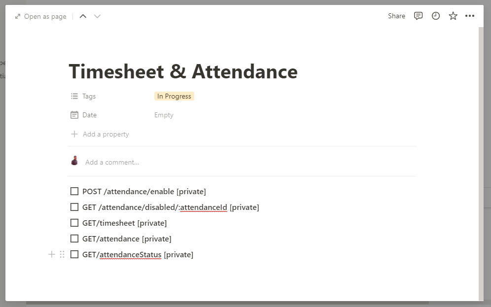
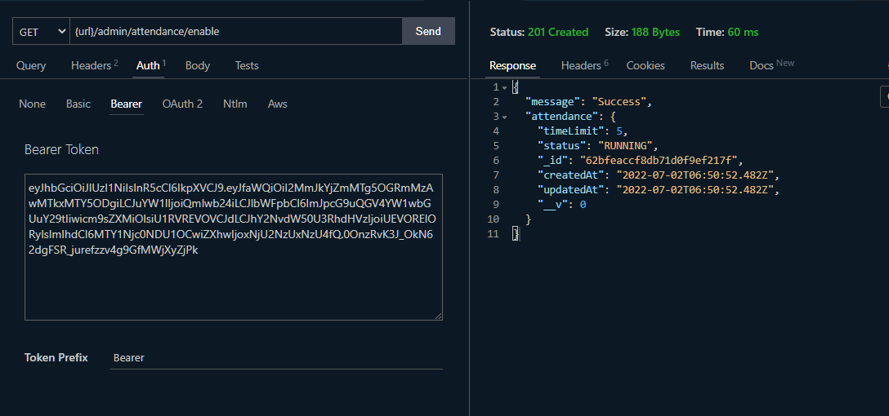
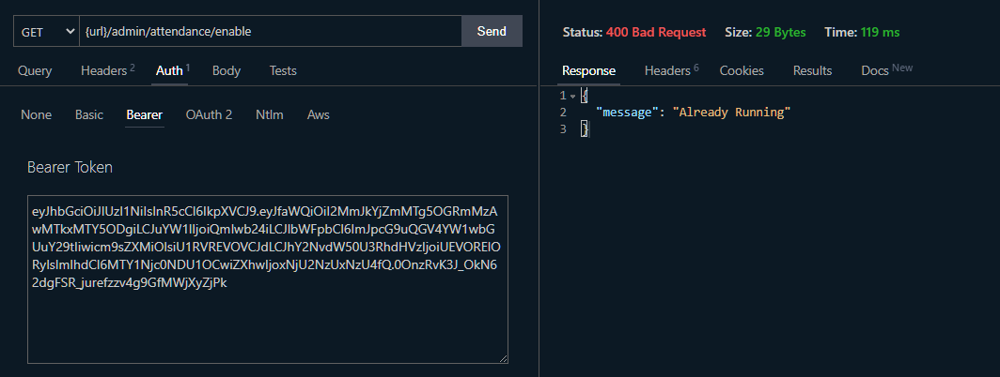
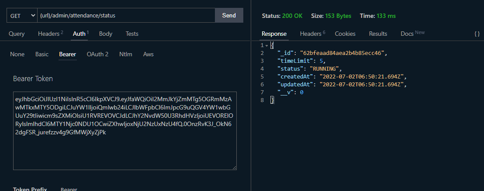
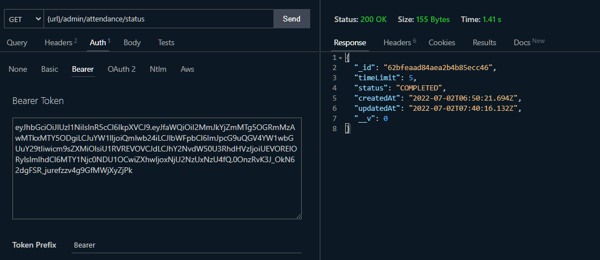
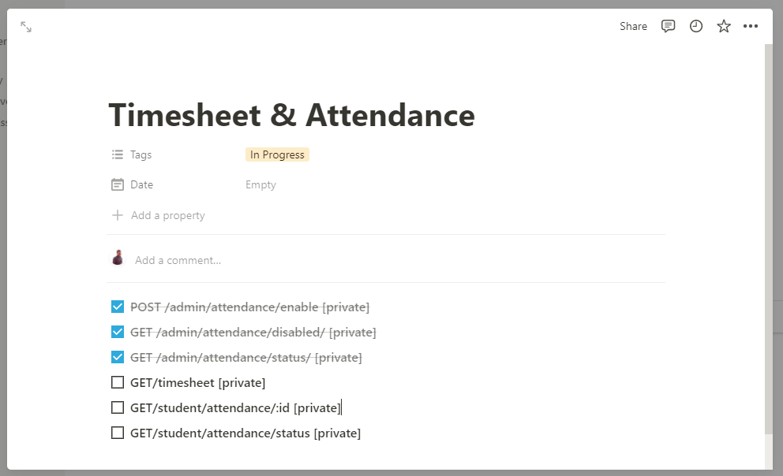
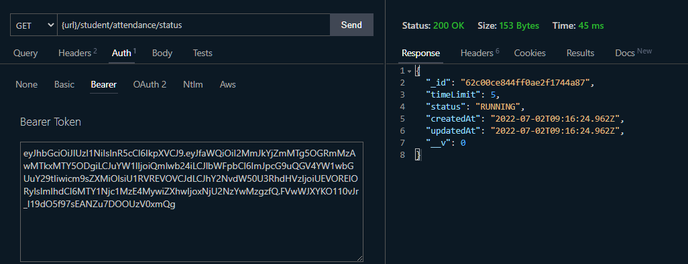
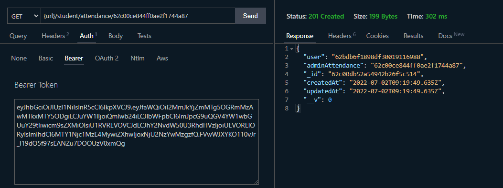
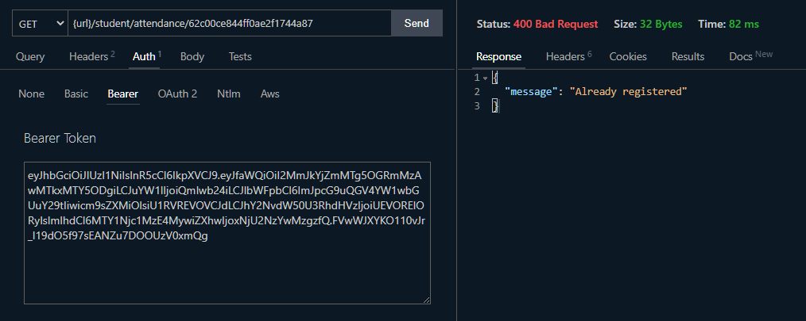
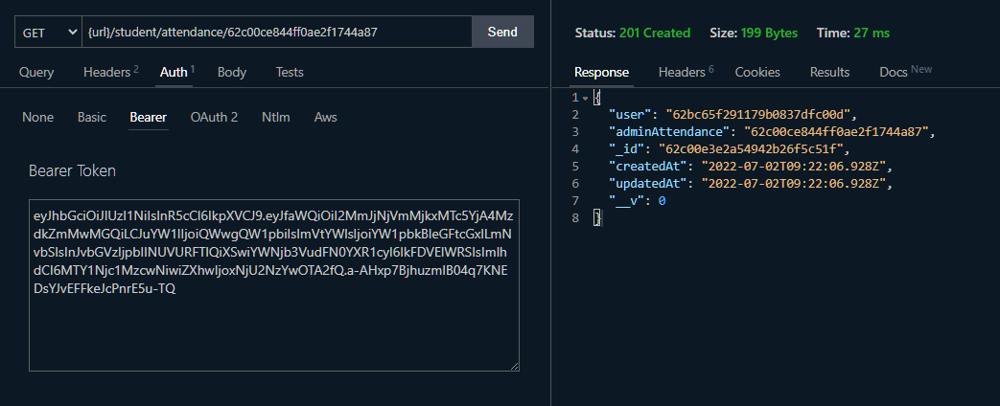

# Lecture 26 - Implement Attendance System Main Functionalities

গতো ক্লাসে আমরা user crud নিয়ে কাজ করেছিলাম। যদিও কিছু কাজ আমরা বাকি রেখেছিলাম। সেগুলো আমরা পরে করবো। আমাদের এই ক্লাসের কাজ হচ্ছে Timesheer and Attendance.



আমাদের টার্গেট হচ্ছে একটা বাটন আছে। আমি অ্যাডমিন। আমি যদি বাটনে ক্লিক করি তাহল অ্যাটেনডেন্স এনেবল হয়ে যাবে। আমরা চাইলে একাধিকবার এটা এনেবল করতে পারবো। তবে খেয়াল রাখতে হবে যদি একই টাইমে একট অ্যাটেনডেন্স এনেবল থাকে তাহলে আর এনেবল করা যাবে না। একই সময় একট অ্যাটেনডেন্স এনেবল থাকবে। এটা এনেবল করার অর্থ হলো একটা ডাটা ক্রিয়েট করে ডাটাবেজে রাখা, যে এই সময়ে একটা অ্যাটেনডেন্স এনেবল হয়েছে এবং সেটা করেছে অ্যাডমিন। এবং এটা কতক্ষণের জন্য এনেবল থাকবে সেটা আমরা টাইম দিয়ে পরবর্তীতে ক্যালকুলেট করবো।

আমরা যদি আমাদের অ্যাটেনডেন্স মডেলের দিকে তাকাই তাহলে দেখবো আমাদের মডেল তৈরি করা আছে এভাবে।

```js
// models/AdminAttendance.js

const { Schema, model } = require('mongoose');

const adminAttendanceSchema = new Schema({
	timeLimit: Number,
	status: String,
	createdAt: Date,
});

const AdminAttendance = model('AdminAttendance', adminAttendanceSchema);

module.exports = AdminAttendance;
```

এখানে createdAt এর সাথে updatedAt ও আমরা রাখতে পারি, কোন সময় আপডেট করা হয়েছে সেটা জানার জন্য। আমরা createdAt এর পুরো লাইনটা বাদ দিয়ে দেবো। createdAt ও updatedAt এর কাজ আমরা করতে পারি timestamps এর মাধ্যমে। যখন কোনো ডাটা ক্রিয়েট হয় তখন অটোমেটিক্যালি createdAt এবং updatedAt timestamps এর মধ্যে তৈরি হয়। আমরা যখন ডাটা আপডেট করবো সেই টাইমটা updatedAt এর মধ্যে স্টোর হয়ে যাবে। সুতরাং আমরা এই ফাইলটাকে একটু চেইঞ্জ করতে পারি নিচের মতো করে।

```js
// models/AdminAttendance.js

const { Schema, model } = require('mongoose');

const adminAttendanceSchema = new Schema(
	{
		timeLimit: {
			type: Number,
			required: true,
			max: 30,
			min: 5,
			default: 5,
		},
		status: {
			type: String,
			required: true,
			enum: ['RUNNING', 'COMPLETED'],
			default: 'RUNNING',
		},
	},
	{ timestamps: true }
);

const AdminAttendance = model('AdminAttendance', adminAttendanceSchema);

module.exports = AdminAttendance;
```

এবার আমাদের এই মডেলটা ব্যবহার করে রাউট আর কন্ট্রোলার তৈরি করতে হবে। আমরা জানি প্রথমে যদি আমরা রাউট তৈরি করতে পারি তাহলে আমাদের জন্য কাজ সহজ হয়ে যাবে। চলুন রাউট তৈরি করে ফেলি।

আমরা routes ফোল্ডারের মধ্যে admin-attendance.js নামে একটা ফাইল তৈরি করবো। এবং আমাদের এনেবল আর ডিজেবলের জন্য রাউট তৈরি করবো।

```js
// routes/admin-attendance.js

const router = require('express').Router();

router.get('/enable', () => {});
router.get('/disable', () => {});

module.exports = router;
```

এবার আমাদের কাজ কন্ট্রোলার তৈরি করা। আমরা কন্ট্রোলারের কাছে গিয়ে admin-attendance.js নামে একটা ফাইল ক্রিয়েট করলাম।

```js
// controller/admin-attendance.js

const getEnable = (req, res, next) => {};

const getDisable = (req, res, next) => {};

module.exports = {
	getEnable,
	getDisable,
};
```

এবার এই ফাংশনগুলোকে আমরা রাউটের মধ্যে পাস করে দিবো।

```js
// routes/admin-attendance.js

const { getEnable, getDisable } = require('../controller/admin-attendance');

const router = require('express').Router();

router.get('/enable', getEnable);
router.get('/disable', getDisable);

module.exports = router;
```

এবার আমরা আমাদের রাউটকে মেইন রাউটের সাথে অর্থাৎ index.js এর সাথে কানেক্ট করবো।

```js
// routes/index.js

const router = require('express').Router();
const authenticate = require('../middleware/authenticate');
const authRoutes = require('./auth');
const usersRoutes = require('./users');
const adminAttendanceRoute = require('./admin-attendance');

router.use('/api/v1/auth', authRoutes);
router.use('/api/v1/users', authenticate, usersRoutes);
router.use('/api/v1/admin/attendance', authenticate, adminAttendanceRoute);

module.exports = router;
```

যেহেতু এটা একটা প্রাইভেট রাউট তাই আমরা আমাদের authenticate মিডলওয়্যারটা যুক্ত করে দিলাম।

এবার আমরা আমদের getEnable কন্ট্রোলার ফাংশনটা কমপ্লিট করি।

```js
// controller/admin-attendance.js

const AdminAttendance = require('../models/AdminAttendance');

const getEnable = async (req, res, next) => {
	try {
		const attendance = new AdminAttendance();
		await attendance.save();
		return res.status(201).json({ message: 'Success', attendance });
	} catch (e) {
		next(e);
	}
};
```

আমরা আলাদাভাবে সার্ভিস না বানিয়ে সার্ভিসের কাজটা আপাতত এখানেই করছি বুঝার সুবিধার্থে। এবার এই ফাংশনটা কাজ করছে কিনা একটু চেক করবো। তবে তার আগে যেহেতু এটা প্রাইভেট রাউট সেহেতু লগইন করে আমাদের টোকেন নিয়ে নিলাম।



একটা অবজেক্ট এসেছে। যেখানে আমাদের মডেলে যেমন যেমন যা চেয়েছিলাম সেগুলো আছে।

এখন আবার যদি আমরা এই রাউটে হিট করি তাহলে আরেকটা টাইমশীট তৈরি হবে। যেটা আমরা শুরুতে বলেছিলাম আমরা চাই না। সেক্ষেত্রে আমাদের কন্ট্রোলারের আমাদের এটা নিয়ে একটু কাজ করতে হবে। যদি স্ট্যাটাস রানিং থাকে তাহলে সে অতটুকুতেই থেমে যাবে আর আমাকে ওয়ার্নিং দিবে। আর নিচে আসতে পারবে না।

```js
// controller/admin-attendance.js

const AdminAttendance = require('../models/AdminAttendance');
const error = require('../utils/error');

const getEnable = async (req, res, next) => {
	try {
		const running = await AdminAttendance.findOne({ status: 'RUNNING' });

		if (running) {
			throw error('Already Running', 400);
		}
		const attendance = new AdminAttendance();
		await attendance.save();
		return res.status(201).json({ message: 'Success', attendance });
	} catch (e) {
		next(e);
	}
};
```



এখানে দেখুন আমরা যখন রানিং থাকা অবস্থায় আবার হিট করলাম আমাদের দেখাচ্ছে Already Running.

এবার আমরা করবো getDisable এর কাজ। এটা করার আগে আমাদের স্ট্যাটাস জানার ব্যাপার আছে। তাই আমরা প্রথমে একটা রাউট ক্রিয়েট করে নিবো। এবং তার জন্য কন্ট্রোলার ফাংশন তৈরি করবো।

```js
// routes/admin-attendance.js

const {
	getEnable,
	getDisable,
	getStatus,
} = require('../controller/admin-attendance');

const router = require('express').Router();

router.get('/enable', getEnable);
router.get('/disable', getDisable);
router.get('/status', getStatus);

module.exports = router;
```

```js
// controller/admin-attendance.js

const getStatus = async (req, res, next) => {
	try {
		const running = await AdminAttendance.findOne({ status: 'RUNNING' });

		if (!running) {
			throw error('Not Running', 400);
		}

		return res.status(200).json(running);
	} catch (e) {
		next(e);
	}
};

module.exports = {
	getStatus,
};
```

এবার আমরা যদি রিকোয়েস্ট পাঠাই status রাউটে তাহলে দেখবো সেটা আমাদের দেখাচ্ছে status running।



আমাদের সিস্টেমের ডিজাইন হচ্ছে যদি টাইমশীট এনেবল থাকে তবে নির্দিষ্ট সময় পর সেটা ডিজেবল হয়ে যাবে। এখানে যদি রানিং না থাকে সেই কোড লিখেছি। যদি রানিং থাকে তাহলে প্রথমে টাইম চেক করতে হবে যে টাইম আছে কিনা। সেটা চেক করার জন্য আমরা একটা লাইব্রেরি ইনস্টল করবো। সেটা হচ্ছে [date-fns](https://date-fns.org/)।

এখন আমাদের চেক করতে হবে createdAt টাইমটা, কারেন্ট টাইম আর টাইম লিমিট এর যোগফল থেকে বড় কিনা। যদি বড় হয় তাহলে সেটা এক্সপায়ার হয়ে গেছে। এই যোগ করার জন্য date-fns এ addMinutes নামের একটা ফাংশন আছে। আমরা এর মধ্যে আর্গুমেন্ট আকারে প্রথমে createdAt টাইম এবং পরে আমাদের টাইমলিমিট দিয়ে দিবো। যেহেতু ডাটাবেজে টাইম স্ট্রিং আকারে আছে সেহেতু ওখানে থেকে Date অবজেক্টের মাধ্যমে আমাদের টাইমটা কনভার্ট করে নিতে হবে। টাইম কমপেয়ার করার জন্য date-fns এ isAfter নামক একটা ফাংশন আছে। চলুন কাজগুলো করে নিই।

```js
// controller/admin-attendance.js

const getStatus = async (req, res, next) => {
	try {
		const running = await AdminAttendance.findOne({ status: 'RUNNING' });

		if (!running) {
			throw error('Not Running', 400);
		}

		const started = addMinutes(new Date(running.createdAt), running.timeLimit);

		if (isAfter(new Date(), started)) {
			running.status = 'COMPLETED';
			await running.save();
		}

		return res.status(200).json(running);
	} catch (e) {
		next(e);
	}
};
```

এবার যদি আমরা রিকোয়েস্ট পাঠাই দেখবো স্ট্যাটাস কমপ্লিট হয়ে গেছে।



এবার আমরা getDisable নিয়ে কাজ করবো।

```js
// controller/admin-attendance.js

const getDisable = async (req, res, next) => {
	try {
		const running = await AdminAttendance.findOne({ status: 'RUNNING' });

		if (!running) {
			throw error('Not Running', 400);
		}

		running.status = 'COMPLETED';
		await running.save();

		return res.status(200).json(running);
	} catch (e) {
		next(e);
	}
};
```

এবার আমাদের রিকোয়েস্ট চেক করি। দেখা যাচ্ছে ডিজেবল রাউটে হিট করলে রানিং টাইমশীট কমপ্লিটেড হয়ে যাচ্ছে।


এখন এনেবল করার পর যে টাইমশীট ক্রিয়েট করবে সেটার আইডির অ্যাগেইনস্টে ছাত্ররা অ্যাটেনডেন্স দিতে পারবে। এবার আমরা কাজ করবো শেষের দুইটা রাউট নিয়ে। টাইমশীট নিয়ে আমরা পরে কাজ করবো।



এই দুইটা রাউট কমপ্লিট হলে আমরা ফ্রন্টএন্ডে মুভ করতে পারবো। ব্যাকএন্ডে আমরা অনেক কাজ ফেলে যাবো। সেগুলো আমরা পরে করবো।

আমরা প্রথমে student-attendance রাউট বানিয়ে ফেলি।

```js
// routes/student-attendance.js

const router = require('express').Router();

router.get('/status', () => {});
router.get('/:id', () => {});

module.exports = router;
```

আমরা এই রাউটকে index.js এ কানেক্ট করবো।

```js
// routes/index.js

const router = require('express').Router();
const authenticate = require('../middleware/authenticate');
const authRoutes = require('./auth');
const usersRoutes = require('./users');
const adminAttendanceRoutes = require('./admin-attendance');
const studentAttendanceRoutes = require('./student-attendance');

router.use('/api/v1/auth', authRoutes);
router.use('/api/v1/users', authenticate, usersRoutes);
router.use('/api/v1/admin/attendance', authenticate, adminAttendanceRoutes);
router.use('/api/v1/student/attendance', authenticate, studentAttendanceRoutes);

module.exports = router;
```

এবার আমরা StudentAttendance মডেলে পূর্বের মতো createdAt কেটে দিয়ে timestamps ইউজ করবো।

```js
// models/StudentAttendance.js

const { Schema, model } = require('mongoose');

const studentAttendanceSchema = new Schema(
	{
		user: {
			type: Schema.Types.ObjectId,
			ref: 'User',
			required: true,
		},
		adminAttendance: {
			type: Schema.Types.ObjectId,
			ref: 'AdminAttendance',
			required: true,
		},
	},
	{ timestamps: true }
);

const StudentAttendance = model('StudentAttendance', studentAttendanceSchema);

module.exports = StudentAttendance;
```

এবার তৈরি করবো আমাদের কন্ট্রোলার।

```js
// controller/student-attendance.js

const StudentAttendance = require('../models/StudentAttendance');

const getAttendance = (req, res, next) => {};

const getAttendanceStatus = (req, res, next) => {};

module.exports = {
	getAttendance,
	getAttendanceStatus,
};
```

```js
// routes/student-attendance.js

const {
	getAttendance,
	getAttendanceStatus,
} = require('../controller/student-attendance');

const router = require('express').Router();

router.get('/status', getAttendanceStatus);
router.get('/:id', getAttendance);

module.exports = router;
```

আমরা এবার getAttendance এবং getAttendanceStatus কন্ট্রোলারগুলো কমপ্লিট করি।

```js
// controller/student-attendance

const { addMinutes, isAfter } = require('date-fns');
const AdminAttendance = require('../models/AdminAttendance');
const StudentAttendance = require('../models/StudentAttendance');
const error = require('../utils/error');

const getAttendance = async (req, res, next) => {
	const { id } = req.params;

	try {
		/**
		 * Step 1 - Find admin attendance by id
		 * Step 2 - Check if it is running or not
		 * Step 3 - Check already register or not
		 * Step 4 - Register entry
		 */

		const adminAttendance = await AdminAttendance.findById(id);

		if (!adminAttendance) {
			throw error('Invalid Attendance ID', 400);
		}

		if (adminAttendance.status === 'COMPLETED') {
			throw error('Attendance already completed');
		}

		let attendance = await StudentAttendance.findOne({
			adminAttendance: id,
			user: req.user._id,
		});

		if (attendance) {
			throw error('Already registered', 400);
		}

		attendance = new StudentAttendance({
			user: req.user._id,
			adminAttendance: id,
		});

		await attendance.save();
		return res.status(201).json(attendance);
	} catch (e) {
		next(e);
	}
};

const getAttendanceStatus = async (req, res, next) => {
	try {
		const running = await AdminAttendance.findOne({ status: 'RUNNING' });

		if (!running) {
			throw error('Not Running', 400);
		}

		const started = addMinutes(new Date(running.createdAt), running.timeLimit);

		if (isAfter(new Date(), started)) {
			running.status = 'COMPLETED';
			await running.save();
		}

		return res.status(200).json(running);
	} catch (e) {
		next(e);
	}
};

module.exports = {
	getAttendance,
	getAttendanceStatus,
};
```

আমরা একটা অ্যাটেনডেন্স এনেবল করে প্রথমে স্ট্যাটাস দেখার চেষ্টা করি।



দেখা যাচ্ছে রানিং আছে। এবার আমরা অ্যাটেনডেন্স দেয়ার চেষ্টা করি।



অ্যাটেনডেন্স ক্রিয়েট হয়েছে। এখন যদি আবার এই ইউজার থেকে আমরা অ্যাটেনডেন্স দিতে চাই তা আর নিবে না।



এবার ভিন্ন একটা আইডিতে লগইন করে সেটার টোকেন দিয়ে অ্যাটেনডেন্স দেয়ার চেষ্টা করি।



সাক্সেসফুলি ডান। যতজন লগইন করবে ততজনই অ্যাটেনডেন্স দিতে পারবে। কিন্তু একবারের বেশি এক ইউজার অ্যাটেন্ডেন্স দিতে পারবে না।

আমাদের সিস্টেম মোটামুটি কমপ্লিট। এবার আমরা ফ্রন্টএন্ডে মুভ করবো। ব্যাকএন্ডে এখনও অনেক কাজ আছে। সেগুলো আমরা যখন লাগবে সেটা বুঝে এগোবো। এতটুকু রেডি আছে মানে আমরা এখন ফ্রন্টএন্ডে জাম্প করতে পারি।


## AUTHOR

[Aditya Chakraborty](https://github.com/adityackr)
