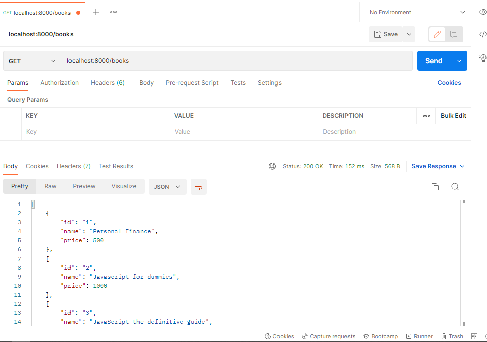
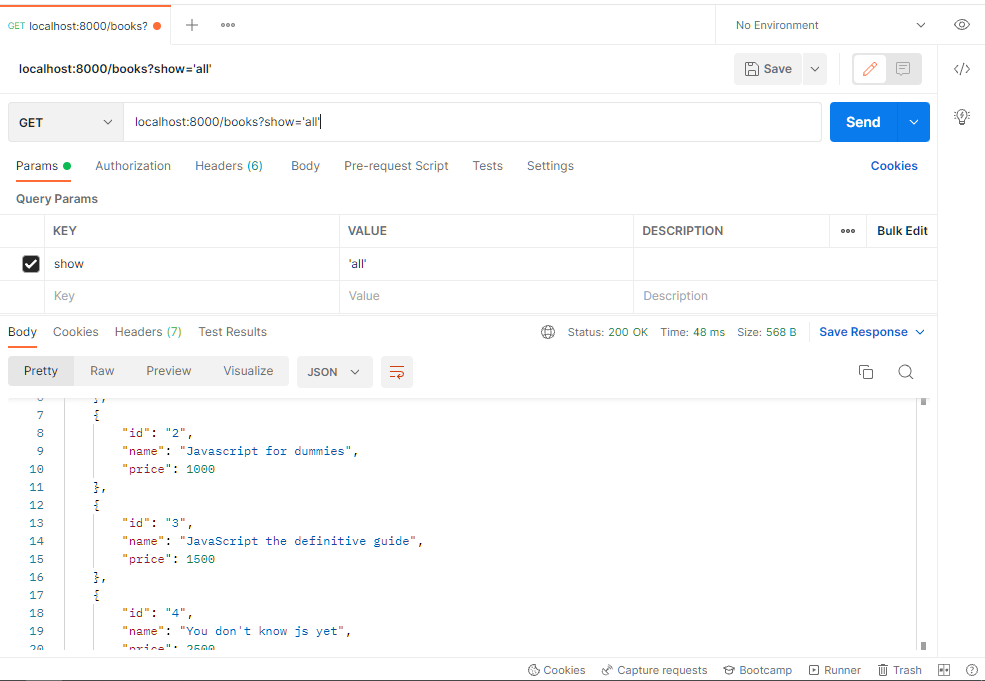
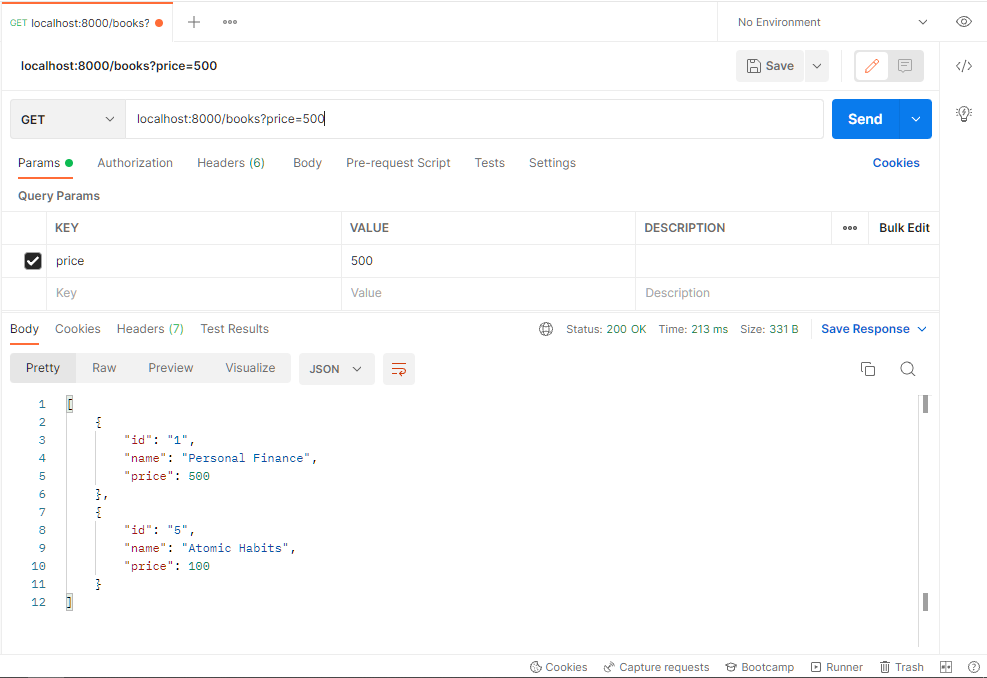
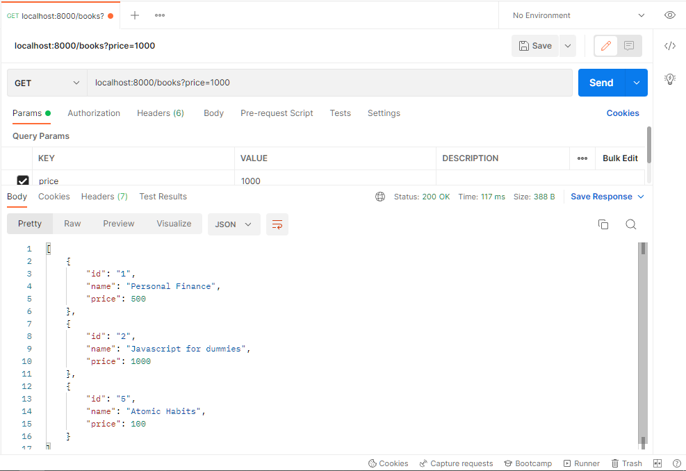
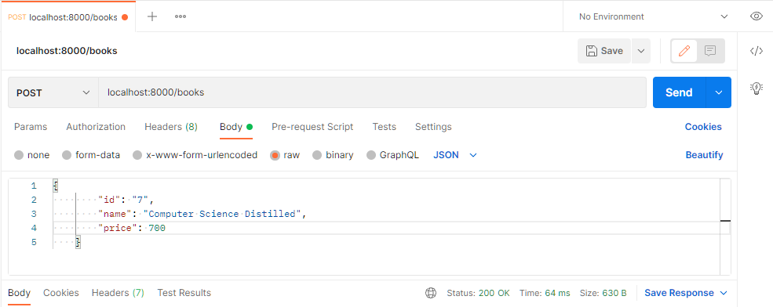

# Lecture 15 - Backend 2 | Introduction to Backend Development

ব্যাকএন্ড শুরু করার আগে আমাদের জানতে হবে এর শুরু এবং শেষ কোথায়। শুরু বোঝা যায়। কিন্তু শেষ কখনই বোঝা সম্ভব হয় না যে কোথায় গিয়ে শেষ করতে হবে। মোটামুটি আমাদের একটা লেভেল পর্যন্ত যেতে হবে, যে লেভেল পর্যন্ত গেলে আমরা এরপর থেকে নিজেরাই বাকি জিনিসগুলো শিখে নিতে পারবো। এখন ব্যাকএন্ডের লার্নিং পাথ কেমন হবে?

ব্যাকএন্ড ডেভেলপারের দায়িত্ব খুব ছোট, আবার খুব বড়। সেটা নির্ভর করছে আপনি কোন কোম্পানিতে জব করছেন তার সাইজের উপর। আপনি যদি নিজের প্রোডাক্ট নিজে ডিজাইন করেন তাহলে ফ্রন্টএন্ড, ব্যাকএন্ড, ডাটাবেজ, API, আর্কিটেকচার, ক্লাউড, সিকিউরিটি, ডকুমেন্টেশন সব নিজেকেই করতে হবে। আপনি যদি ৫/৬ জনের একটা টিমে কাজ করেন তখনও অনেক কাজ করতে হবে। তবে কিছু কিছু ভাগ হয়ে যাবে। আপনি যদি স্টার্টআপ কোম্পানিতে জব করেন যেখানে টিম মোটামুটি বড়, সেক্ষেত্রে আপনার হয়তো ব্যাকএন্ড অ্যাপ্লিকেশন নিয়ে কাজ করতে হচ্ছে বা সিস্টেম ডিজাইন নিয়ে কাজ করতে হচ্ছে। ক্লাউড বা অন্য কিছু নিয়ে কাজ করতে হচ্ছে না। যদি আপনি এন্টারপ্রাইজ কোম্পানিতে জব করেন তখন কাজগুলো অনেক স্পেসিফিক হয়ে যায়। এমনও হতে পারে আপনাকে ডকুমেন্টেশন বানানোর জন্য নেয়া হয়েছে, বা আপনাকে আর্কিটেকচার তৈরির জন্য নিয়েছে, বা টেস্ট কোড লেখার জন্য নিয়েছে, বা API ডিজাইনের জন্য নিয়েছে। তখন কাজ অনেক সহজ হয়ে যায়।

আমরা এখন নিজেদের বিল্ড করছি। নিজেদের গড়ে তোলার জন্য কোন কোন বিষয়গুলো আমাদের শুরুতে শিখতে হবে তার একটা পরিকল্পনা লাগবে। পরিকল্পনা নিচে দেয়া হলো।

- API Design: API ডিজাইন বলতে যে জিনিসটা বুঝায় সেটা হলো ডাটা পাস করা। ক্লায়েন্ট এবং সার্ভারের মধ্যে কমিউনিকেশন করার একটা মাধ্যম তৈরি করা। আমরা এই কাজ অনেকভাবে করতে পারি।
  - REST API: বেশিরভাগ সময় আমরা API ডিজাইনের জন্য যেটা ব্যবহার করি তা হলো REST API।
  - GraphQL: REST API এর পরে আরেকটা জনপ্রিয় টুল আছে, সেটা হলো GraphQL।
  - gRPC: তৃতীয় আরেকটা উপায় আছে। সেটা হলো gRPC।
  - SOAP: পূর্বে ছিল SOAP। যেটা এখন ধরতে গেলে লাগবেই না। ১% এরও কম ব্যবহার হয় এটা বর্তমানে। এটা লাগবে, যখন আপনি এমন একটা সার্ভিস নিয়ে কাজ করছেন যেটা আজ থেকে ১৫ বছর আগে কাজ করেছিল SOAP নিয়ে, সেক্ষেত্রে আপনার এটা লাগতে পারে।
  - Web Socket: এটা রিয়েলটাইম কমিউনিকেশনের জন্য ব্যবহার করা হয়। এটা স্কেল করা অনেক কঠিন।
  - Message Broker: এটা দরকার হবে যখন আমরা দুইটা API এর মধ্যে কমিউনিকেশন করবো তখন। এটা আরেক লেভেলের কনসেপ্ট। বিগিনার হিসেবে এটা এখন দরকার নেই। কারণ এটা মোটেও বিগিনার ফ্রেন্ডলি না।
- API Security
  - JWT Token
  - Refresh Token: এটা খুব হাইলি সিকিউরড সিস্টেমগুলোতে ব্যবহার করা হয়।
  - OAuth2: আমরা বিভিন্ন জায়গায় দেখি যে আমাদের জিমেইল, ফেইসবুক, গিটহাব ইত্যাদি একাউন্ট থাকলে আমরা সেগুলো দিয়ে লগইন করতে পারি। সাইনআপ করার প্রয়োজন পড়ে না। OAuth2 দিয়ে আমরা এই সিস্টেম করতে পারি। এটা বিগিনার হিসেবে আমাদের প্রয়োজন নাই।
  - SAML (Security Assertion Markup Language): এটা সিঙ্গেল সাইন অনের ক্ষেত্রে বেশি ব্যবহার করা হয়। এটাও আমাদের বিগিনার হিসেবে দরকার নাই।
  - Identity Providers: এতে আছে Cognito, Auth0, Firebase, Okta ইত্যাদি। বিগিনার হিসেবে আমাদের এই কনসেপ্টের এখন কোনো প্রয়োজন নাই।
  - Role Based Authorization: অথেনটিকেশন আর অথোরাইজেশনের মধ্যে একটা পার্থক্য রয়েছে। সেটা হলো আমি যখন লগইন করলাম, আমি অথেনটিকেট করলাম। আমার আইডি অথেনটিকেশন সিস্টেম পার হয়ে লগইন হলো। এখন লগইন করলেও আমি সব জায়গায় এন্ট্রি নিতে পারবো না। এখানে রোল ভাগ করা। ফেইসবুক গ্রুপের কথা চিন্তা করি। আপনি যখন মেম্বার তখন আপনি শুধু পোস্ট করতে পারবেন, লাইক, কমেন্ট করতে পারবেন, আর শুধু নিজের পোস্ট বা কমেন্ট ডিলিট করতে পারবেন। মডারেটর যারা তারা অন্যের পোস্ট, কমেন্ট বা কোনো মেম্বারকে গ্রুপ থেকে ডিলিট করতে পারলেও অ্যাডমিনকে পারবে না। অ্যাডমিন সব কিছু করতে পারবে। সবকিছুর এক্সেস তার আছে। অ্যাডমিন যাকে যে রোলে অথোরাইজ করেছে সে শুধু সেই রোলই পালন করতে পারবে। এটাকে বলে Role Based Authorization.
- API Testing
  - Unit Testing
  - Acceptance Testing
  - Load Testing
- API Documentation
  - Swagger: অটো জেনারেটেড ডকুমেন্টেশনের জন্য আমরা এটা ব্যবহার করে থাকি।
  - Postman: আমরা ডেইলি বেসিসে যেটা ব্যবহার করি সেটা হলো পোস্টম্যান। পোস্টম্যানে সুন্দর ডকুমেন্টেশন করা যায় এবং শেয়ারও করা যায়।

উপরের এই চারটা জিনিস শিখতে গেলে আমাদের কিছু কিছু বিষয় জানতে হবে। সেগুলো হলোঃ

- Database: ডাটাবেজ সম্পর্কে একদম ইঞ্জিনিয়ার বা অ্যাডমিনিস্ট্রেটর হওয়ার প্রয়োজন নেই। কিন্তু হালকাপাতলা আমাদের ডাটাবেজ সম্পর্কে জানতে হবে। ডাটাবেজের কুয়েরি লেখা অনেক কঠিন কাজ। আমরা কিছু সফটওয়্যার আছে যাদের ORM (Object Relational Mapping) বলে, সেগুলো দিয়ে সুন্দরভাবে ডাটাবেজের কাজ করতে পারবো। অনেকগুলো ডাটাবেজ আছে। তার মধ্যে কিছু কম ডাটাবেজের নাম নিচে দেয়া হলো।
  - NoSQL
    - MongoDB
    - AWS DynamoDB
  - SQL
    - PostgreSQL
    - MySQL
    - MSSQL / Oracle
  - In Memory: SQL বা NoSQL আমরা আমাদের সুবিধামতো যেটা খুশি সেটা নিয়ে কাজ করতে পারি। কিন্তু In Memory নিয়ে আমাদের মাস্ট কাজ করতে হবে। এটা মূলত ব্যবহার করা হয় ক্যাশিং এর কাজে। যেটা এখন must neede.
    - Redis: এটা ক্যাশিং ছাড়াও আরো অনেক ছোট ছোট কাজে ব্যবহার করা যায়। তাই আমাদের প্রেফারেন্স সবসময় রেডিস।
    - Mem Cached: এটা শুধুমাত্র ক্যাশিং এর কাজেই ব্যবহার করা হয়।
  - Graph Database: এটা এখন ধীরে ধীরে জনপ্রিয় হচ্ছে। তবে বিগিনার হিসেবে আমাদের প্রয়োজন নাই। এই ধরণের ডাটাবেজ ব্যবহার করা হয় বিভিন্ন কমপ্লেক্স টাইপের ডাটা মডেল তৈরি করার ক্ষেত্রে। যেমন মেশিন লার্নিং করে আমরা প্রোডাক্ট রিকমেন্ডেশন করে থাকি। আমরা যদি আমাজনে সার্চ করি কিছু তাহলে ঐ প্রোডাক্ট রিলেটেড কোন কোন প্রোডাক্ট আছে, কোনগুলো মানুষ বেশি কিনে, কোনগুলো জনপ্রিয় এরকম কিছু সাজেশন্স আসে। এগুলো কিছু র‍্যানডম ডাটা। কোনো স্ট্রাকচারেই এগুলো ফেলা যাবে না। এখন প্রতিবার যদি আমাদের বায়িং বিহেভিয়ারকে লার্ন করতে থাকে, তাহলে সেটা অনেক কমপ্লেক্স হয়ে যায়। কারণ মেশিন লার্নিং এর যে সার্ভার খরচ সেটা তুলনামূলক অনেক বেশি। কারণ এখানে প্রচুর কম্পিউটিং পাওয়ার দরকার হয়। তো এখানে কি করা যায় কিছু সময়ের জন্য আমরা আমাদের ডাটাকে একটা ডাটাবেজে সেচ করে রাখতে পারি। ধরেন ২৪ ঘন্টার জন্য। ২৪ ঘন্টা পরে ডাটা চেইঞ্জ হয়ে যাবে, নতুন ডাটা ক্রিয়েট হবে। এরকম র‍্যান্ডম ডাটার ক্ষেত্রে গ্রাফ ডাটাবেজ অনেক কাজ দেয়।
    - Neo4j
- Linux Server: ডাটাবেজের পর আমাদের লিনাক্স সার্ভার সম্পর্কে কিছুটা জানতে হয়।
- Cloud Computing: ক্লাউড কম্পিউটিং নিয়ে একটা ধারণা থাকা দরকার।
- DevOps: ডেভঅপ্স সম্পর্কে কিছুটা ধারণা থাকতে হয়।

Linux Server, Cloud Computing, DevOps এগুলো নিয়ে আমাদের ভাবার প্রয়োজন নেই। আমরা এগুলো এখন ভাববো না। যখন ভাবার ভাববো।

উপরের এত এত নাম দেখে অনেকের ভয় লাগতে পারে। তাদের উদ্দেশ্যে বলছি, এখানে যা যা আছে সব সহজ। কিন্তু ব্যাকএন্ডের সবচেয়ে কঠিন একটা জিনিস আছে। সেটা হলো রিকোয়ারমেন্টের উপর ভিত্তি করে সিস্টেমটা ডিজাইন করে। ক্লায়েন্ট এমনভাবে একটা রিকোয়ারমেন্ট দিবে যেটা দিয়ে প্রোগ্রামিং এর সাথে মিলানো যাবে না। আমাদেরকে সেটা চুলছেড়া বিশ্লেষন করে সবার মধ্যে সম্পর্ক বের করে সিদ্ধান্ত নিতে হবে আমরা কোনটা কোনটা ব্যবহার করবো। এটাই সবচেয়ে কঠিন কাজ। বাকি যা যা এখানে দেখা যাচ্ছে এগুলো অনেক সহজ।

এবার আসি যদি আমরা একটা API ডিজাইন করতে চাই তাহলে আমদের কি কি লাগবে? কি প্রোগ্রামিং ল্যাঙ্গুয়েজ আমরা ব্যবহার করবো, কি কি জিনিস হ্যান্ডেল করবো, কিভাবে হ্যান্ডেল করবো সেগুলো নিয়ে।

আমাদের আগে জানতে হবে সার্ভার কি করে? সার্ভারের কাজ কি? সার্ভারের কাজ সার্ভ করা। কি সার্ভ করা? রিকোয়েস্ট সার্ভ করা। আমরা এবার সার্ভার অ্যাপ্লিকেশন রেসপন্সিবিলিটিজগুলো একটু দেখি। পুরো ব্যাকএন্ডে মূলত তিনটা কাজ। রিকোয়েস্ট লিসেন করা, প্রসেসিং করা এবং রেস্পন্স করা।

এই তিনটা কাজ করার জন্য আমরা একটা ফ্রেমওয়ার্ক বেছে নিই। কারণ API এর প্রতিটা কাজে আমাদের এই তিনটা জিনিস লাগবে। চলুন আমরা আমাদের প্রথম একটা সার্ভার তৈরি করে ফেলি।

লেকচার ১৩ তে npm, yarn, package.json, package install এসব নিয়ে আলোচনা করা হয়েছে। তাই আর এগুলো নিয়ে এখানে বলা হচ্ছে না।

আমরা প্রথমে server.js নামে একটা ফাইল ক্রিয়েট করবো। প্রথমে আমরা কোনো ফ্রেমওয়ার্কের সাহায্য না নিয়ে raw nodejs নিয়ে কাজ করি।

```js
const http = require('http');

const server = http.createServer((req, res) => {
	if (req.url === '/') {
		res.write('<h1>Hello World</h1>');
		res.statusCode = 200;
		res.end();
	} else if (req.url === '/hello') {
		res.write('<h1>Hello Guest</h1>');
		res.statusCode = 200;
		res.end();
	} else {
		res.write('<h1>404 not found!</h1>');
		res.statusCode = 200;
		res.end();
	}
});

server.listen(8000, () => {
	console.log('Server is listening on port 8000');
});
```

প্রথমে আমরা nodejs থেকে http module ইমপোর্ট করে আনলাম। এরপর সার্ভার তৈরি করলাম http.createServer লিখে। এখানে একটা কলব্যাক ফাংশন থাকবে। এর দুইটা প্যারামিটার থাকবে। req and res. আমরা একটা কন্ডিশন লিখলাম। কন্ডিশনটা আশা করি বুঝতে পারছেন। যদি আমরা '/' এ হিট করি তাহলে আমাদের পেইজে শো করবে `Hello World`. যদি '/hello' তে হিট করি তাহলে আমাদের পেইজে শো করবে `Hello Guest`. আর যদি অন্য কোনো রাউটে হিট করি তাহলে শো করবে `404 not found!`। এরপর আমাদের সার্ভার লিসেন করতে হবে। আমরা পোর্ট `8000` দিয়ে দিবো লিসেন করার জন্য।

এবার আমরা ব্যাকএন্ডের যে তিনটা কাজের কথা বলেছিলাম সেই তিনটা কাজ এখানে হয়েছে কিনা দেখি। এখানে আমাদের সার্ভার আমাদের রিকোয়েস্ট লিসেন করছে। সেটা প্রসেসও করছে, এবং সবশেষে রেসপন্স ব্যাক করছে। এখানে রিকোয়েস্ট লিসেন করা আর রেসপন্স ব্যাক করা সবসময় একই। কিন্তু প্রসেস করার ক্ষেত্রে আমাদের যতো ঝামেলা। চলুন আমরা একটা ওভারভিউ দেখি।

- Listen Request
  - Always Same
- Process
  - Algorithm
  - Data Structure
  - Database
  - Problem Solving
  - CRUD
- Response
  - Always Same

এখানে এই কাজগুলো দেখেন বারবার বারবার লিখতে হচ্ছে। তাই আমরা এবার একটা ফ্রেমওয়ার্ক ইনস্টল করে নিবো যার নাম এক্সপ্রেস।

এক্সপ্রেসে কিভাবে সার্ভার বানাতে হয় তা লেকচার ১৩ তে সুন্দরভাবে বলা হয়েছে। এখানে শুধু উদাহরণ দেখানো হবে। ডিটেইলসে আলোচনা ওখানে করা হয়েছে। আপনারা সেখান থেকে শিখতে পারবেন।

```js
const express = require('express');

const app = express();
app.use(express.json());

const books = [
	{
		id: '1',
		name: 'Personal Finance',
		price: 500,
	},
	{
		id: '2',
		name: 'Javascript for dummies',
		price: 1000,
	},
	{
		id: '3',
		name: 'JavaScript the definitive guide',
		price: 1500,
	},
	{
		id: '4',
		name: "You don't know js yet",
		price: 2500,
	},
	{
		id: '5',
		name: 'Atomic Habits',
		price: 100,
	},
	{
		id: '6',
		name: 'JavaScript the good parts',
		price: 1200,
	},
];

app.get('/books', (req, res) => {
	if (req.query.show === 'all') {
		return res.json(books);
	}

	if (req.query.price === '500') {
		const result = books.filter((book) => book.price <= 500);
		return res.json(result);
	}

	if (req.query.price === '1000') {
		const result = books.filter((book) => book.price <= 1000);
		return res.json(result);
	}

	return res.json(books);
});

app.post('/books', (req, res) => {
	const book = req.body;
	books.push(book);

	res.json(books);
});

app.listen(8000, () => {
	console.log('Server is listening on port 8000');
});
```

কিছু কমন HTTP request method আছে। যেমনঃ

- GET - want to read data from server
- POST - create new data
- PUT/PATCH - update existing content
- DELETE - delete data from database

এবার একটু আমরা রাউটিং প্যাটার্ন দেখি, কোন কাজ করতে গেলে কিরকম রাউট হতে হবে।

- GET Everything - /books
- Get one book - /books/bookId
- POST new book - /books
- Update Book - /books/bookId
- Delete Book - /book/booksId

উপরের উদাহরণে books নামে একটা অ্যারে নেয়া হয়েছে। এই অ্যারেতে অনেকগুলো বইয়ের অবজেক্ট আছে যেখানে বইয়ের একটা আইডি দেয়া আছে, বইয়ের নাম দেয়া আছে আর দাম দেয়া আছে। এবার আমরা চাইছি '/books' এ হিট করলে সব বই শো করবে, '/books?show='all' এ হিট করলে সব বই শো করবে, '/books?price=500' এ হিট করলে ৫০০ টাকা পর্যন্ত দামের বইগুলো দেখাবে এবং '/books?price=1000' এ হিট করলে ১০০০ টাকা পর্যন্ত দামের বইগুলো দেখাবে। সেটা আমরা get মেথডের মাধ্যমে করলাম। এবার আমি চাইছি নতুন বই ঢুকাবো এই লিস্টে। তার জন্য আমাদের ইউজ করতে হবে post মেথড। আমরা রিকোয়েস্ট বডি থেকে যে অবজেক্ট পাবো তা অ্যারেতে পুশ করে দিবো।

আমাদের একটু পোস্টম্যানে চেক করে দেখি আমাদের সার্ভার ঠিকঠাক কাজ করছে কিনা।

আমরা প্রথমে আমাদের সার্ভার রান করে নিবো `yarn start` লিখে। start এর জায়গায় আপনি package.json এ যা দিবেন তা লিখবেন।

নিচে পর্যায়ক্রমে '/books', '/books?show='all', '/books?price=500', '/books?price=1000' এর রেজাল্টের স্ন্যাপশট দেয়া হলো।






এবার আমাদের POST মেথড কাজ করে কিনা দেখি। নিচে তার স্ক্রিনশট দেয়া হলো।




আমাদের POST রিকোয়েস্টও সাক্সেসফুলি কাজ করছে।

এবার আমরা আমাদের ব্যাকএন্ডের কাজগুলোকে একটা পাইপলাইন আকারে দেখাই।

REQUEST -> MIDDLEWARE[logger, body parser, file parser, user ip, block ip, authentication, authorization, validation] -> CONTROLLER (Business Logic) -> MIDDLEWARE[error handler] -> RESPONSE

মিডলওয়্যার, কন্ট্রোলার নিয়ে আমরা পরবর্তী ক্লাসগুলোতে আলোচনা করবো।

পরবর্তী ক্লাস বুঝতে হলে এক্সপ্রেস সম্পর্কে বেসিক একটা ধারণা থাকা জরুরী। এই ধারণার জন্য স্ট্যাক লার্নার চ্যানেলে একটা ছোট প্লেলিস্ট আছে। যার নাম হচ্ছে [Express Js Crash Course In Bangla](https://youtube.com/playlist?list=PL_XxuZqN0xVDm9HkiP4h_76qNBZix6XME)। আপনারা এই প্লেলিস্ট শেষ করলে এক্সপ্রেস সম্পর্কে একটা বেসিক ধারণা পাবেন। সবাইকে এই প্লেলিস্ট শেষ করেই পরবর্তী লেকচার দেখার জন্য পরামর্শ দেয়া হচ্ছে।


## AUTHOR

[Aditya Chakraborty](https://github.com/adityackr)
